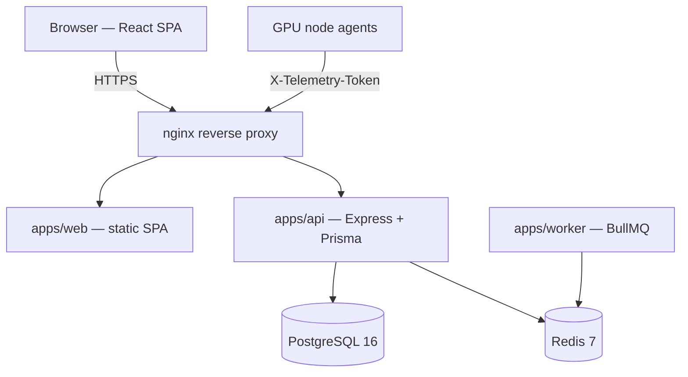

# GPU Resource Management Platform

[](https://github.com/coder-rohit1477/gpu-allocation-system/actions/workflows/ci.yml)


A production-oriented platform for allocating shared GPU hardware across
students, faculty, and administrators in an academic setting: role-based
booking with faculty approval, live GPU telemetry, conflict-free scheduling,
department-level administration, and usage analytics.

## Contents

- [Architecture](#architecture)
- [Tech stack](#tech-stack)
- [Monorepo layout](#monorepo-layout)
- [Features](#features)
- [Quick start (local dev)](#quick-start-local-dev)
- [Docker](#docker)
- [Environment variables](#environment-variables)
- [Scripts](#scripts)
- [Testing](#testing)
- [CI/CD](#cicd)
- [Documentation](#documentation)

## Architecture



A TypeScript pnpm monorepo, not the MERN/MongoDB prototype this project
started as — see [Documentation](#documentation) for how that transition
happened. The backend is a modular monolith (Express + Prisma/PostgreSQL)
organized into one directory per domain module
(`apps/api/src/modules/*`), each with its own `*.dto.ts` (Zod validation),
`*.service.ts` (business logic), `*.repository.ts` (Prisma queries),
`*.controller.ts`, and `*.routes.ts`. Modules only ever import another
module's *public* exports (service/repository functions), never reach into
its internals — the same discipline every phase of this build followed.

## Tech stack

| Layer | Technology |
|---|---|
| Language | TypeScript (strict mode) everywhere — backend, frontend, shared packages |
| API | Express 4, Zod validation, JWT (access) + httpOnly rotating refresh cookies |
| Database | PostgreSQL 16 via Prisma ORM |
| Cache / pub-sub | Redis 7 (ioredis) |
| Background jobs | BullMQ |
| Frontend | React 19, React Router 7, Vite — no CSS framework, no chart library (hand-built, accessible, colorblind-validated chart primitives in `@gpu/ui`) |
| Testing | Vitest — unit tests for pure logic, Supertest-driven integration tests against a real Postgres/Redis for every module |
| Logging | `pino` structured JSON logs (`apps/api`, `apps/worker`) |
| Package management | pnpm workspaces |
| Containers | Multi-stage Docker builds per app, Docker Compose for both dev and production topologies |
| CI | GitHub Actions — install, build, typecheck, lint, test, Prisma schema validation |

## Monorepo layout

```text
apps/
  api/      Express API — one module per domain, see apps/api/src/modules/*
  web/      React SPA — student portal + admin analytics area
  worker/   BullMQ background worker (foundation stub)
  demo-telemetry-simulator/  DEV/DEMO ONLY synthetic GPU node-agent — see
                              "Demo environment" below, never deployed to
                              production
packages/
  types/    Shared TypeScript types/contracts (API request/response shapes)
  sdk/      Typed fetch client used by apps/web, built on packages/types
  ui/       Shared React components + chart primitives (Button, Card, Badge,
            Tabs, BarChart, TrendChart, StatusBar, ...) and design tokens
  config/   Shared tsconfig/eslint presets every package/app extends
infra/
  nginx/    Edge reverse-proxy config for the production Compose stack
docs/
  api.md            Full REST API reference
  deployment.md      Production deployment runbook
  architecture.md, conflict-detection.md, realtime-notifications.md,
  testing-strategy.md  Historical design docs from the pre-rebuild
                        MongoDB/Socket.IO prototype (see below)
backend/, frontend/,
docker-compose.legacy.yml   The original MERN prototype — retained for
                             history, not part of the running system, not
                             covered by CI or the instructions in this file
```

> **About `backend/`, `frontend/`, and `docs/architecture.md` et al.**
> This project began as a MongoDB/Express/React/Socket.IO prototype (still
> present under `backend/`/`frontend/`, unmodified, excluded from linting
> and CI). [`ARCHITECTURE_AUDIT_AND_REDESIGN.md`](./ARCHITECTURE_AUDIT_AND_REDESIGN.md)
> is the audit that proposed rebuilding it as the TypeScript/PostgreSQL
> modular monolith under `apps/`/`packages/` that this README describes —
> that rebuild is what actually shipped. `docs/architecture.md`,
> `docs/conflict-detection.md`, `docs/realtime-notifications.md`, and
> `docs/testing-strategy.md` are the *original* prototype's docs, kept for
> history; they describe the old system, not this one.
> [`docs/api.md`](./docs/api.md) and [`docs/deployment.md`](./docs/deployment.md)
> are current.

## Features

- **Authentication & RBAC** — JWT access tokens + rotating httpOnly refresh
  cookies with reuse detection, five roles (`SUPER_ADMIN`, `DEPARTMENT_ADMIN`,
  `LAB_ADMIN`, `FACULTY`, `STUDENT`), department-scoped authorization.
- **University administration** — organizations, departments, laboratories,
  courses, GPU inventory, user management.
- **GPU telemetry** — heartbeat/metrics ingestion from node agents, derived
  `ONLINE`/`DEGRADED`/`OFFLINE` connectivity, maintenance windows.
- **Booking engine** — conflict-free scheduling, a smart best-fit allocator
  (picks the smallest GPU node that satisfies a request rather than the
  first available), an automatic status worker that advances reservations
  through `APPROVED → ACTIVE → COMPLETED` on wall-clock time.
- **Faculty workflow** — a per-department dashboard, course workspace,
  weekly lab schedule, and transactional bulk approve/reject with a
  research-vs-coursework priority queue.
- **Student portal** — dashboard, GPU explorer with live status, reservation
  management, a weekly calendar, history with CSV export, and a
  notification center derived from the student's own reservation activity.
- **Analytics & reporting** — university/department/GPU/student/course
  analytics and daily/weekly/monthly reports, each exportable as CSV, with
  hand-built (no external chart library) colorblind-validated chart
  components.
- **Production-ready deployment** — multi-stage Docker builds, an nginx
  edge reverse proxy, structured logging, liveness/readiness health
  endpoints, and a CI pipeline that gates every push.

## Quick start (local dev)

Prerequisites: Node.js ≥ 22.13, pnpm ≥ 9, Docker (for Postgres/Redis).

```bash
git clone git@github.com:coder-rohit1477/gpu-allocation-system.git
cd gpu-allocation-system
pnpm install

# Start Postgres + Redis only (the dev compose file — see Docker below)
docker compose up -d postgres redis

# Copy and fill in per-app env files
cp apps/api/.env.example apps/api/.env
cp apps/worker/.env.example apps/worker/.env
cp apps/web/.env.example apps/web/.env
# apps/api/.env needs real secrets even in dev — see the file's comments
# for `openssl rand -hex 32` pointers.

# Apply the schema and (optionally) seed sample data
pnpm --filter @gpu/api run prisma:migrate
pnpm --filter @gpu/api run prisma:seed   # optional — creates a super-admin
                                          # and sample org/dept/lab/course data

# Run every app in watch mode
pnpm dev
```

- API: <http://localhost:4000> (health: `/health`, `/ready`, `/live`)
- Web: <http://localhost:5173>
- Prisma Studio: `pnpm --filter @gpu/api run prisma:studio`

## Docker

Two Compose files, two different jobs:

| File | Purpose |
|---|---|
| `docker-compose.yml` | Local dev convenience — Postgres/Redis (+ optionally the built app containers) with host ports exposed directly, hardcoded dev-only credentials |
| `docker-compose.prod.yml` | Production topology — single nginx ingress, no direct port exposure for Postgres/Redis/API/web, every secret from the environment with no insecure default. See [`docs/deployment.md`](./docs/deployment.md) for the full runbook. |
| `docker-compose.demo.yml` | DEV/DEMO ONLY override — adds a synthetic GPU telemetry simulator on top of `docker-compose.prod.yml` so a local demo has `ONLINE` GPUs without physical hardware. Never used standalone, never part of a production deploy. See [Demo environment](#demo-environment) below. |

Build and run the whole stack (any variant):

```bash
# Dev
docker compose up -d --build

# Production
cp .env.prod.example .env.prod   # fill in real secrets first
docker compose -f docker-compose.prod.yml --env-file .env.prod up -d --build
```

### Demo environment

There's no physical GPU hardware in a local/demo environment, so every
seeded GPU node starts `OFFLINE` and there's nothing for a student to book
or a faculty member to approve. `docker-compose.demo.yml` — a DEV/DEMO-ONLY
override, never part of the production topology — adds
`demo-telemetry-simulator`, a small standalone service
(`apps/demo-telemetry-simulator`) that calls the *real* telemetry
ingestion endpoints (`POST /telemetry/heartbeat` and `/metrics`, same
`TELEMETRY_INGEST_TOKEN` shared secret a physical node-agent would use) on
a loop, so nodes go `ONLINE` through the actual heartbeat-recency logic —
nothing is hardcoded or bypassed.

```bash
# Bring up the full demo stack (production topology + the simulator).
# University structure/users/GPU inventory are seeded automatically by the
# one-shot `demo-seed` service (runs inside the compose network, before
# the simulator starts) — no separate seed step needed.
cp .env.prod.example .env.prod   # fill in real secrets first
docker compose -f docker-compose.prod.yml -f docker-compose.demo.yml \
  --env-file .env.prod up -d --build

# Create one pending reservation + bring its GPU node online, so there's
# something for a faculty account to approve immediately — idempotent,
# safe to rerun
pnpm --filter @gpu/api run prisma:demo-seed
```

Every 12 seeded GPU nodes go `ONLINE` within one heartbeat interval
(~10s). Log in as `muj-stu-0001@muj.manipal.edu` (student) or
`muj-fac-0001@muj.manipal.edu` (faculty) — password `ChangeMe123!` for
every seeded account — to walk the booking → approval flow end to end.

## Environment variables

Each app documents its own required variables in `apps/<app>/.env.example`
(dev) and the root `.env.prod.example` (production). Summary:

| App | Key variables |
|---|---|
| `apps/api` | `DATABASE_URL`, `REDIS_URL`, `CORS_ORIGINS`, `JWT_ACCESS_SECRET`, `REFRESH_TOKEN_PEPPER`, `TELEMETRY_INGEST_TOKEN`, `LOG_LEVEL` |
| `apps/worker` | `REDIS_URL`, `LOG_LEVEL` |
| `apps/web` | `VITE_API_URL` (build-time — empty string in production so the SPA calls same-origin through the nginx proxy) |

Every required variable is validated at process start
(`apps/api/src/config/env.ts`, `apps/worker/src/config/env.ts`) — a missing
one fails startup immediately with a clear `Missing required environment
variable: X` error rather than an obscure failure later.

## Scripts

Run from the repo root (pnpm workspace-aware):

| Script | What it does |
|---|---|
| `pnpm dev` | Every app in watch mode, in parallel |
| `pnpm build` | Build `packages/*` then `apps/*`, in that order |
| `pnpm typecheck` | `tsc --noEmit` in every package/app |
| `pnpm lint` / `pnpm lint:fix` | ESLint across the whole workspace |
| `pnpm format` / `pnpm format:check` | Prettier |
| `pnpm test` | Vitest (currently `apps/api`'s unit + integration suite) |
| `pnpm clean` | Remove build output in every package/app |

## Testing

`apps/api` has the project's test suite: fast unit tests for pure logic
(GPU allocator scoring, date-bucketing math, priority-queue ordering, ...)
alongside Supertest-driven integration tests that exercise every module
end-to-end against a real local Postgres + Redis — RBAC, conflict
detection, the reservation status worker, bulk-approval transactions and
rollback, analytics aggregation, and more.

```bash
docker compose up -d postgres redis
pnpm --filter @gpu/api run prisma:deploy
pnpm test
```

## CI/CD

Every push and pull request runs [`.github/workflows/ci.yml`](./.github/workflows/ci.yml)
against real Postgres/Redis service containers:

**install → generate Prisma client → validate Prisma schema → build →
typecheck → lint → apply migrations → test**

All six checks must pass before merging. See the CI badge at the top of
this file.

## Documentation

- [`docs/api.md`](./docs/api.md) — full REST API reference (every route,
  required role, and a worked example)
- [`docs/deployment.md`](./docs/deployment.md) — production deployment,
  TLS, backups, scaling, troubleshooting
- [`ARCHITECTURE_AUDIT_AND_REDESIGN.md`](./ARCHITECTURE_AUDIT_AND_REDESIGN.md) —
  the audit/redesign proposal this system was rebuilt from
