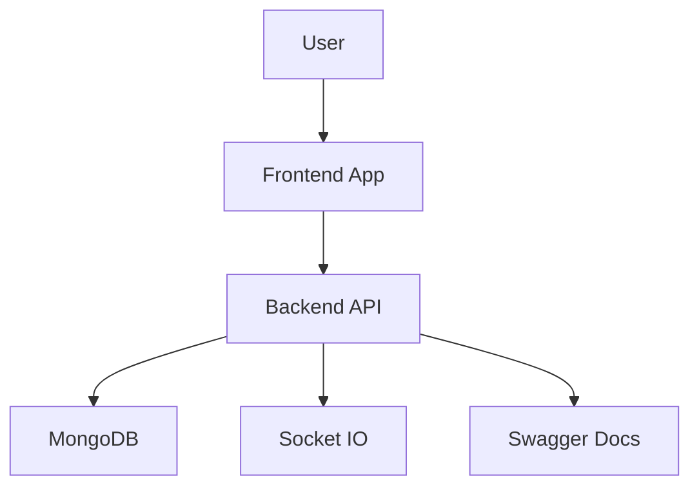
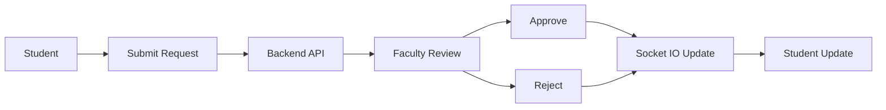
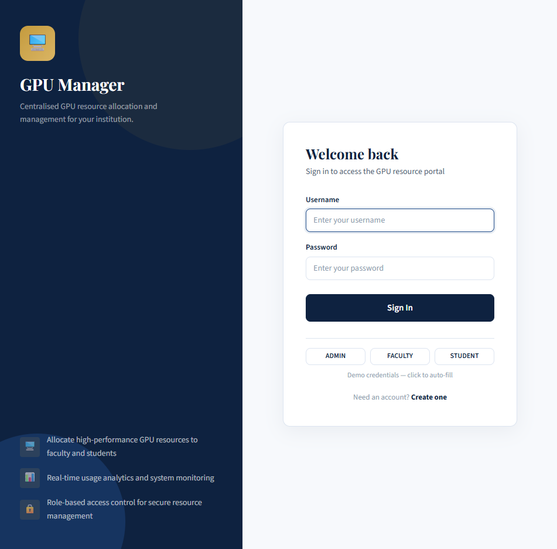
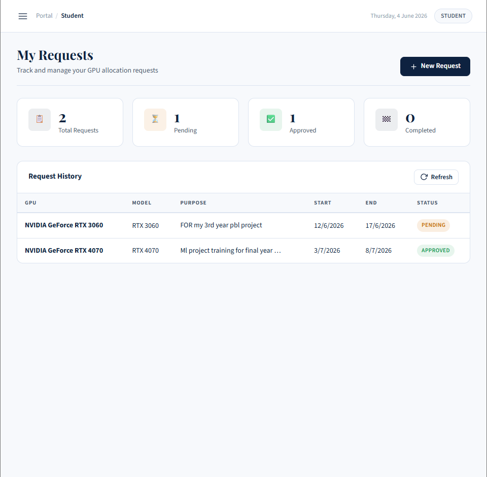
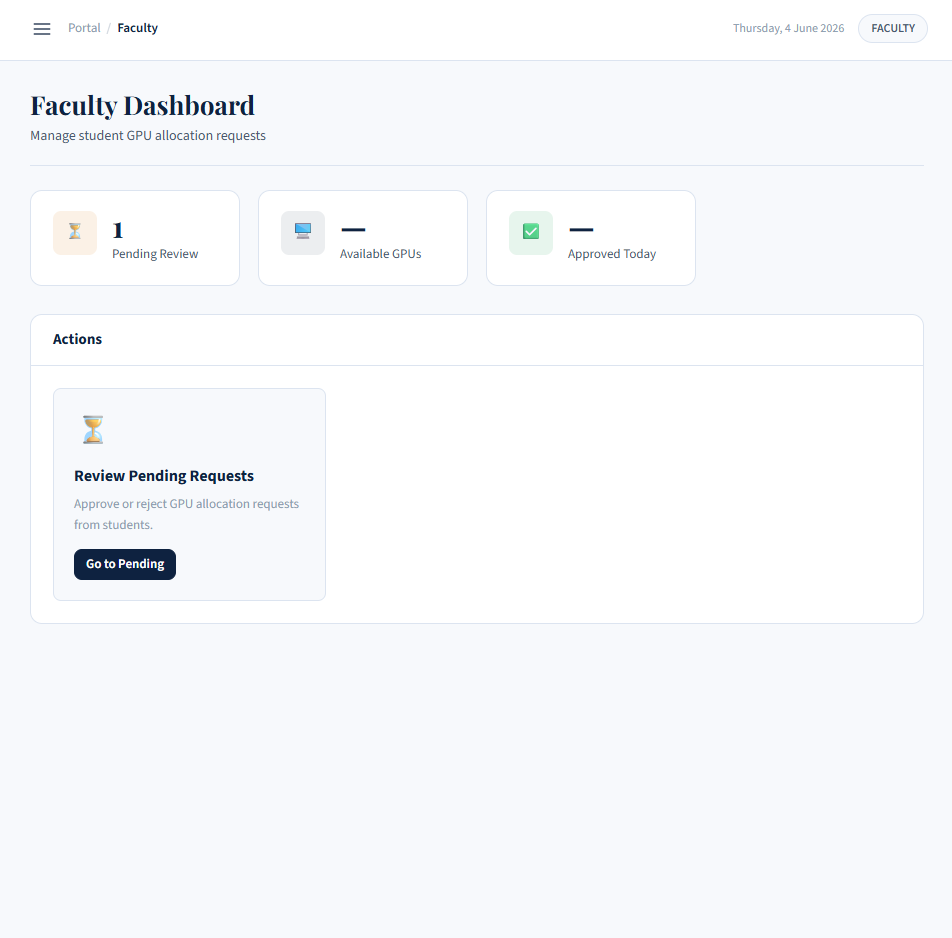
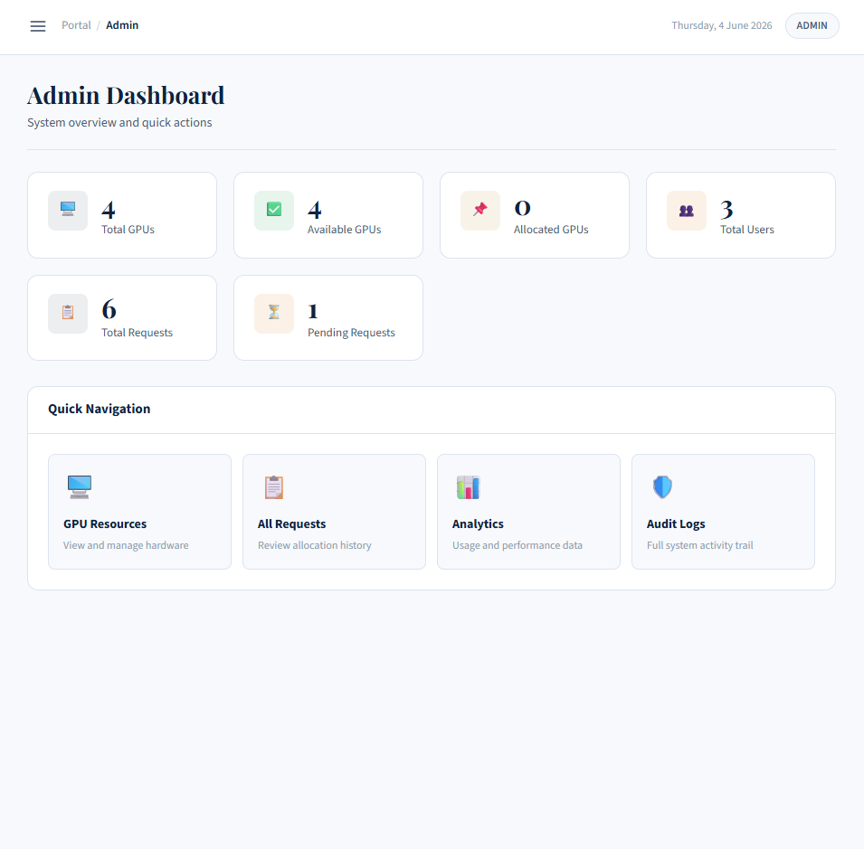
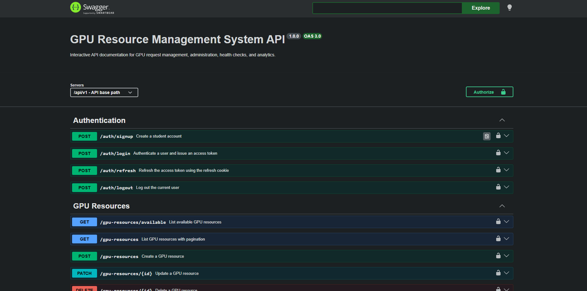

# PBL GPU Manager

GPU Resource Management System for academic labs and shared compute environments.

## Overview

PBL GPU Manager is a full-stack platform for allocating shared GPU hardware across students, faculty, and administrators. It combines role-based access control, request approval workflows, realtime notifications, conflict detection, audit logging, health monitoring, and Swagger-based API documentation into one production-oriented application.

The repository contains:

- A React frontend with role-specific dashboards
- An Express and Mongoose backend
- MongoDB persistence for users, GPU resources, requests, and audit records
- Socket.IO for targeted realtime updates
- GitHub Actions CI for automated verification
- Integration tests built around MongoMemoryServer

## Problem Statement

Shared GPU labs usually rely on manual coordination and spreadsheet-level tracking. That creates predictable failures:

- the same GPU can be assigned to overlapping requests
- students cannot reliably track approval status
- faculty lack a clean review workflow
- administrators have limited traceability into who did what and when
- hardware availability is difficult to monitor in real time

This system addresses those issues by making allocation, notification, auditing, and monitoring part of the application itself rather than external manual processes.

## Key Features

- Authentication and RBAC
  - JWT access tokens
  - httpOnly refresh cookies
  - backend-enforced role restrictions for STUDENT, FACULTY, and ADMIN

- GPU Request Workflow
  - student request creation
  - faculty approval and rejection
  - approved allocations update GPU capacity
  - completed requests restore capacity

- Conflict Detection
  - prevents the same GPU from being assigned to overlapping approved requests
  - returns HTTP `409 Conflict` for overlap violations

- Audit Logging
  - records login, logout, request creation, approval, rejection, and GPU allocation
  - stores actor, action, timestamp, and metadata

- Real-Time Notifications
  - Socket.IO events sent to the requesting student
  - targeted room-based delivery

- Health Monitoring
  - `/live`
  - `/ready`
  - `/health`

- Swagger/OpenAPI
  - interactive `/api-docs`
  - JWT bearer auth support
  - request and response schemas

- Automated Testing
  - integration-heavy backend coverage
  - MongoMemoryServer-based isolation
  - realtime socket testing

- CI/CD
  - GitHub Actions backend test job
  - GitHub Actions frontend build job

## System Architecture



The application is organized into three main layers:

- Frontend
  - React app with role-specific dashboards
  - Axios client with auth interceptors
  - Socket.IO client for realtime updates

- Backend
  - Express API under `backend/server`
  - Route, controller, middleware, and service layers
  - Swagger/OpenAPI docs at `/api-docs`
  - Socket.IO server for targeted notifications

- Data and runtime
  - MongoDB stores users, GPU resources, requests, and audit logs
  - Docker Compose can run the full stack together

## Request Workflow



Request handling follows a simple flow:

- Student submits a GPU request from the frontend
- Backend validates and stores the request
- Faculty approves or rejects the request
- Approval checks prevent overlapping GPU allocations
- The backend emits a targeted Socket.IO update to the student

## Conflict Detection

Conflict detection happens during approval, before the request becomes authoritative.

### Problem

Two approved requests must not claim the same GPU during overlapping time windows. If they do, hardware is over-allocated and the schedule becomes invalid.

### Overlap Algorithm

The backend loads the target request and the selected GPU, then checks for any already approved request with:

- the same `gpuResourceId`
- a different request ID
- an overlapping date range

The effective overlap condition is:

- `existing.startDate < request.endDate`
- `existing.endDate > request.startDate`

### HTTP 409 Behavior

If a conflict exists, the approval endpoint stops immediately and returns HTTP `409 Conflict` with the message that the selected GPU is already assigned to an overlapping approved request.

This behavior is covered by integration tests in `backend/tests/gpu-allocation-overlap.test.js`.

## Real-Time Notifications

Realtime updates are delivered with Socket.IO.

### JWT Socket Auth

The socket connection uses the same JWT identity model as HTTP. The server accepts the token from socket handshake auth or from the Authorization header, verifies it, and loads the current user from MongoDB.

### User Rooms

Each authenticated socket joins a room named:

- `user:<userId>`

That keeps notifications isolated to the requesting student instead of broadcasting to all connected clients.

### Targeted Events

When a faculty member approves or rejects a request, the backend emits a targeted event to the student’s room:

- `request:approved`
- `request:rejected`

Payloads include:

- `requestId`
- `status`
- `gpuId`
- `timestamp`

## Audit Logging

The audit log infrastructure records important user and system actions without changing core business behavior.

### Logged Events

- `USER_LOGIN`
- `USER_LOGOUT`
- `REQUEST_CREATED`
- `REQUEST_APPROVED`
- `REQUEST_REJECTED`
- `GPU_ALLOCATED`

### Traceability

Each record stores:

- `action`
- `actorId`
- `timestamp`
- `metadata`

This gives administrators a complete trail of security-sensitive and workflow-sensitive activity, including who initiated the action, what happened, and what contextual data was associated with it.

## Testing Strategy

The backend uses integration-focused tests with real HTTP requests and an in-memory MongoDB instance.

### What the suite covers

- authentication
- GPU request creation
- approval and rejection
- conflict detection
- realtime notifications
- health endpoints
- socket authentication
- basic health and connectivity behavior

### Current status

- `19 passing tests`
- `7 passing suites`

### MongoMemoryServer

MongoMemoryServer provides isolated test databases so each test file starts with a clean state and does not depend on a developer’s local MongoDB instance.

### Integration Testing

Tests use:

- `supertest` for HTTP endpoints
- `socket.io-client` for realtime events
- `mongoose` models for persisted-state assertions

Supporting documentation:

- [Testing Strategy](docs/testing-strategy.md)

## API Documentation

Swagger UI is available at:

- `/api-docs`

It documents:

- authentication endpoints
- GPU request endpoints
- GPU resource endpoints
- admin endpoints
- analytics endpoints
- health endpoints

The OpenAPI definition includes:

- JWT bearer authentication
- request schemas
- response schemas
- status codes

## Health Endpoints

Production-style health monitoring endpoints are available without checking business logic.

- `/live`
  - liveness probe
  - returns `{ "status": "ok" }`

- `/ready`
  - readiness probe
  - returns MongoDB connection state
  - reports either connected or disconnected

- `/health`
  - general health snapshot
  - includes MongoDB status, uptime, and environment

These endpoints are lightweight and use the existing Mongoose connection state.

## CI/CD

GitHub Actions runs two checks on every push and pull request:

- Backend job
  - installs dependencies
  - runs the full Jest test suite

- Frontend job
  - installs dependencies
  - runs the production build

This means the repository continuously verifies:

- backend correctness
- frontend build integrity
- API and realtime behavior through tests

Workflow file:

- [`.github/workflows/ci.yml`](.github/workflows/ci.yml)

## Local Development Setup

### Prerequisites

- Node.js 18 or newer
- MongoDB locally or via Atlas

### Backend

```bash
cd backend
copy .env.example .env
npm install
npm run seed
npm start
```

### Frontend

```bash
cd frontend
npm install
npm run dev
```

### Docker

```bash
docker compose up --build
```

Optional seed command:

```bash
docker compose exec backend node scripts/seed.js
```

## Environment Variables

### Backend

| Variable | Purpose | Example |
|---|---|---|
| `MONGODB_URI` | MongoDB connection string | `mongodb://localhost:27017/pbl-gpu-manager` |
| `JWT_SECRET` | JWT signing secret | `your_very_long_secret_here` |
| `JWT_EXPIRES_IN` | Access token lifetime | `15m` |
| `REFRESH_TOKEN_EXPIRES_IN` | Refresh token lifetime | `7d` |
| `PORT` | API server port | `5001` |
| `NODE_ENV` | Runtime environment | `development` |
| `ALLOWED_ORIGINS` | Allowed frontend origins | `http://localhost:5173,http://localhost:80` |

### Frontend

| Variable | Purpose | Example |
|---|---|---|
| `VITE_API_BASE_PATH` | Axios base path | `/api` |

## Project Structure

```text
.
├── backend
│   ├── app.js
│   ├── server
│   │   ├── config
│   │   ├── controllers
│   │   ├── docs
│   │   ├── middleware
│   │   ├── models
│   │   ├── modules
│   │   ├── realtime
│   │   └── routes
│   └── tests
├── docs
├── frontend
│   ├── public
│   └── src
├── docker-compose.yml
└── README.md
```

## Screenshots

## Application Screenshots

### Login Page


### Student Dashboard


### Faculty Dashboard


### Admin Dashboard


### API Documentation



## Future Improvements

- Add frontend end-to-end tests
- Add audit log filtering and export
- Add richer analytics visualizations
- Add deployment notes for cloud hosting

## Project Highlights

- Built a role-based GPU allocation platform with JWT auth, RBAC, realtime notifications, and audit logging.
- Implemented conflict-safe GPU approval logic that prevents overlapping allocations and returns deterministic HTTP `409` responses.
- Added production-style health monitoring endpoints and a Swagger/OpenAPI documentation surface for operational readiness.
- Created an integration-first backend test suite using MongoMemoryServer, Supertest, and Socket.IO client coverage.
- Established CI automation with GitHub Actions to validate backend tests and frontend build integrity on every push and pull request.
