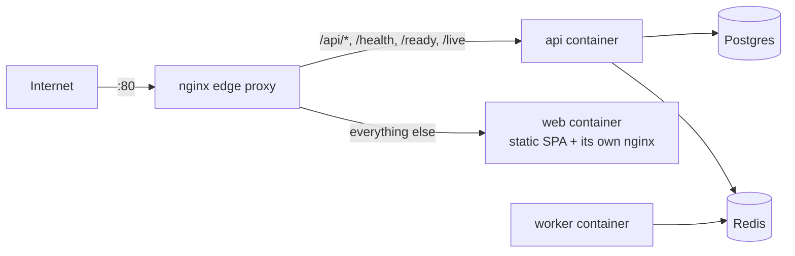

# Deployment Guide

This guide covers running the GPU Resource Management Platform in
production with Docker Compose. It assumes a single host (VM or bare
metal) — the same containers/images work behind a container orchestrator
(Kubernetes, ECS, Nomad, ...) with the compose file as a reference for what
each service needs, but that translation isn't covered here.

## Architecture



- **`nginx`** — the only container that publishes a host port. Reverse-proxies
  API traffic to `api:4000` and everything else to `web:80`. Config:
  [`infra/nginx/nginx.conf`](../infra/nginx/nginx.conf).
- **`web`** — the built React SPA, served by its *own* nginx baked into the
  image ([`apps/web/Dockerfile`](../apps/web/Dockerfile),
  [`apps/web/nginx.conf`](../apps/web/nginx.conf)). Built with
  `VITE_API_URL=""` in production so it calls the API same-origin
  (`/api/v1/...`) through the edge proxy — no CORS involved for real traffic.
- **`api`** — the Express/Prisma backend. Also runs the automatic
  reservation-status sweep (advances `APPROVED → ACTIVE → COMPLETED` on
  wall-clock time) on a 30s interval inside the same process.
- **`worker`** — a BullMQ/Redis worker process (currently a foundation
  stub — see `apps/worker/src/index.ts`).
- **`migrate`** — one-shot container that runs `prisma migrate deploy` and
  exits; `api`/`worker` wait for it to succeed before starting.
- **`postgres`**, **`redis`** — not exposed to the host at all in
  production, only reachable on the internal compose network.

## Prerequisites

- Docker Engine 24+ and Docker Compose v2 (`docker compose version`)
- A domain/origin the app will be served from (for `PUBLIC_ORIGIN` / CORS)
- Ability to generate secrets: `openssl rand -hex 32`

## 1. Configure environment

```bash
cp .env.prod.example .env.prod
```

Fill in every value in `.env.prod` — see the comments in that file for what
each one is. The stack **refuses to start** if a required secret
(`POSTGRES_PASSWORD`, `JWT_ACCESS_SECRET`, `REFRESH_TOKEN_PEPPER`,
`TELEMETRY_INGEST_TOKEN`, `PUBLIC_ORIGIN`) is missing — Docker Compose's
`${VAR:?message}` syntax fails the whole `up` with that message rather than
silently booting with a dev placeholder.

`.env.prod` is gitignored — never commit it. Keep a copy in your secrets
manager (Vault, SOPS, cloud secrets store, ...), not in the repo.

## 2. Build and start

```bash
docker compose -f docker-compose.prod.yml --env-file .env.prod up -d --build
```

This builds five images (`migrate`/`api` share one image, `worker`, `web`,
plus the stock `postgres`/`redis`/`nginx` images), runs the one-shot
migration, then starts `api`, `worker`, `web`, and `nginx`.

Watch it come up:

```bash
docker compose -f docker-compose.prod.yml --env-file .env.prod logs -f
```

## 3. Verify

```bash
# Edge proxy is up and routing to the API:
curl -f http://localhost/health

# Readiness — checks Postgres + Redis from inside the API container:
curl -f http://localhost/ready

# The SPA loads:
curl -fsS http://localhost/ | grep -o '<title>[^<]*' 

# Every container reports healthy (all Dockerfiles ship a HEALTHCHECK):
docker compose -f docker-compose.prod.yml --env-file .env.prod ps
```

All services in the `ps` output should show `(healthy)`, not
`(unhealthy)` or `(starting)` after ~30s.

## 4. Seed data (optional, first deploy only)

The seed script creates a super-admin account and sample org/department/lab
data — useful for a fresh environment, not idempotent-safe to re-run against
real data with real users:

```bash
docker compose -f docker-compose.prod.yml --env-file .env.prod \
  exec api pnpm run prisma:seed
```

Skip this in a real production environment once real accounts exist —
create the first `SUPER_ADMIN` directly instead (see `apps/api/prisma/seed.ts`
for the account-creation pattern, or insert one manually via `prisma studio`
in a maintenance window).

## TLS

`infra/nginx/nginx.conf` terminates HTTP only, on port 80. For a real
deployment, either:

- Put a TLS-terminating load balancer in front (cloud LB, Cloudflare, a
  separate Caddy/Traefik instance) and point it at this stack's `nginx` — the
  most common pattern for a containerized deploy; forward the LB's
  `X-Forwarded-Proto` header through (`infra/nginx/nginx.conf` already sets
  it towards `api`/`web`, so `app.set("trust proxy", 1)` in `apps/api`
  correctly infers HTTPS for cookies/redirects), **or**
- Add a `listen 443 ssl` server block to `infra/nginx/nginx.conf` directly,
  mount your certificate/key into the `nginx` service, and publish `443` in
  `docker-compose.prod.yml`.

Either way, once traffic is HTTPS end-to-end, set `COOKIE_DOMAIN` in
`.env.prod` if you need the session cookie shared across subdomains, and
double-check `PUBLIC_ORIGIN` uses `https://`.

## Database migrations (subsequent deploys)

New code that includes a Prisma migration: rebuild and let `migrate` run
again before `api`/`worker` start —

```bash
docker compose -f docker-compose.prod.yml --env-file .env.prod up -d --build
```

`prisma migrate deploy` (what the `migrate` service runs) only applies
migrations that haven't been applied yet — safe to run on every deploy.

## Rolling back

```bash
git checkout <previous-tag-or-commit>
docker compose -f docker-compose.prod.yml --env-file .env.prod up -d --build
```

There is no automatic migration rollback — Prisma migrations in this
project are forward-only. If a migration must be undone, write and commit a
new migration that reverses it, rather than reaching for `prisma migrate
reset` (which drops all data) against a database with real users.

## Backups

Back up the `postgres_data` named volume (or, better, run Postgres as a
managed database service and back that up per the provider's tooling —
`docker-compose.prod.yml`'s `postgres` service is meant for
small/self-hosted deployments; swap `DATABASE_URL` to point at a managed
instance for anything with real uptime requirements). Redis in this app is
disposable pub/sub + best-effort caching, not a source of truth — it does
not need backing up.

```bash
docker compose -f docker-compose.prod.yml --env-file .env.prod \
  exec postgres pg_dump -U "$POSTGRES_USER" "$POSTGRES_DB" > backup.sql
```

## Scaling

- `api` is stateless (sessions live in signed cookies + Postgres/Redis) —
  safe to run multiple replicas behind `nginx` once you move past a single
  `docker compose` host to something that supports it (Compose itself
  doesn't load-balance multiple containers of one service without extra
  tooling).
- Keep the `migrate` service to exactly one run per deploy even with
  multiple `api` replicas — it already only runs once per `up`, not once
  per replica.
- `worker` can also run multiple replicas — BullMQ jobs are distributed
  across whichever worker picks them up.

## Observability

- **Structured logs**: both `api` and `worker` emit JSON lines (via `pino`)
  in production — one line per HTTP request (method, path, status, duration)
  plus application events. Ship `docker compose logs` (or the container
  runtime's log driver output) to your log aggregator of choice; there's
  no vendor-specific transport baked in. Adjust verbosity with `LOG_LEVEL`
  in `.env.prod` (`fatal`/`error`/`warn`/`info`/`debug`/`trace`/`silent`).
- **Health checks**: point your uptime monitor at `GET /health` (through
  `nginx`, i.e. `https://<your-domain>/health`) and/or `GET /ready` for a
  deeper dependency check. Both are already what each container's own
  Docker `HEALTHCHECK` uses internally.

## Troubleshooting

| Symptom | Likely cause |
|---|---|
| `docker compose up` exits immediately with a message about a missing variable | A required secret in `.env.prod` is empty — see step 1 |
| `api`/`worker` stuck `(starting)` and never `(healthy)` | `migrate` hasn't completed — check `docker compose logs migrate`; usually a bad `DATABASE_URL` or Postgres not actually healthy yet |
| Browser requests to `/api/...` get CORS errors | `PUBLIC_ORIGIN` doesn't exactly match the origin the browser loaded the page from (scheme + host + port) |
| Login works but the session doesn't persist across requests | `COOKIE_DOMAIN` mismatch, or the app is being accessed over HTTP while a load balancer in front terminates HTTPS without forwarding `X-Forwarded-Proto` |
| `GET /ready` returns `503` | Check the response body — it names which of `database`/`cache` is unreachable |
